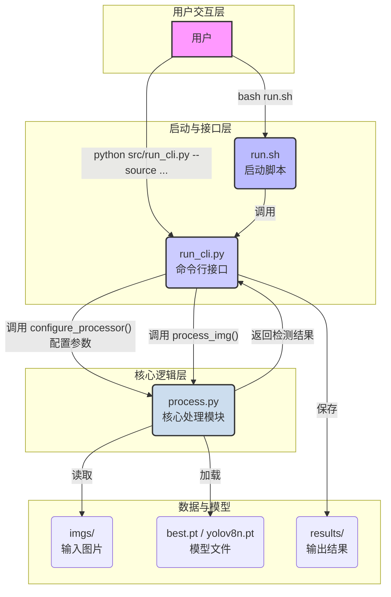

# 网球目标检测项目 (YOLOv8)

这是一个基于 YOLOv8 的网球目标检测项目。它被设计为一个功能完整且易于扩展的模板，涵盖了从训练到检测再到结果可视化的完整流程。

## 核心特性

- **清晰的架构分层**: 项目采用三层架构（启动层、接口层、核心逻辑层），职责分明，易于维护。
- **灵活的调用方式**: 支持多种运行方式，满足从一键测试到精细化调试的各种需求。
- **强大的脚本支持**: 提供 `run.sh` 脚本，可自动完成模型查找、训练、检测等任务。
- **模块化API**: 核心检测功能被封装在 `process_img` 函数中，可作为独立的库轻松集成到其他程序。
- **动态配置**: 支持通过 `configure_processor` 函数在运行时安全地修改检测参数。

## 项目架构

本项目采用清晰的三层分离架构，确保了代码的高度模块化、可维护性和可扩展性。



- **启动层 (`run.sh`)**: 项目的最外层封装。它为用户提供了一键式的操作体验，能自动处理环境检查、模型查找、按需训练、启动检测等一系列复杂任务。它是进行**标准化、可复现操作**的首选。
- **接口层 (`src/run_cli.py`)**: 命令行接口（CLI）。它负责解析用户通过命令行传入的各种参数（如输入源、模型路径、置信度阈值等），然后通过调用 `configure_processor()` 函数将这些配置安全地传递给核心逻辑层。它是进行**灵活、可定制化测试与调试**的"专业工具"。
- **核心逻辑层 (`src/process.py`)**: 项目的大脑。它包含了核心的 `process_img()` 检测函数和模型加载逻辑。它与外界的交互完全通过其定义的函数接口进行，不依赖于任何特定的调用方式。它作为**可重用的库**，可以被任何程序轻松集成。

---

## 环境设置

1.  **创建虚拟环境**
    - 推荐使用 `uv` (来自 Astral):
        ```bash
        uv venv
        ```
    - 或者使用 Python 内置的 `venv`:
        ```bash
        python3 -m venv .venv
        ```

2.  **激活虚拟环境**
    ```bash
    source .venv/bin/activate
    ```
    **重要提示**: 在执行本项目中的任何 Python 或 Shell 脚本之前，**务必先激活虚拟环境**。

3.  **安装依赖**
    - `uv` 用户:
        ```bash
        uv pip install -r requirements.txt
        ```
    - `pip` 用户:
        ```bash
        pip install -r requirements.txt
        ```

---

## 如何运行

本项目提供了多种运行方式，以适应不同的使用场景。

### 方式一：使用启动脚本 (推荐)

这是最简单、最可靠的运行方式，适用于绝大多数场景。

**使用方法**:
```bash
bash run.sh
```

**工作流程**:
1.  **智能模型查找**: 自动在 `tennis_ball_runs/` 目录中查找最新的训练成果（`best.pt`）。
2.  **按需训练**: 如果未找到任何已训练的模型，它会自动调用 `yolo` 开始一个新的训练任务。
3.  **执行检测**: 使用找到的（或新训练的）模型，对 `imgs/` 目录下的图片进行检测。
4.  **保存结果**: 检测结果（包括标注图片和数据文件）会自动保存在 `results/` 下的一个带时间戳的目录中。

### 方式二：使用命令行接口 (用于灵活调试)

当你需要对特定文件进行测试，或者想要微调检测参数时，这是最佳选择。

**使用示例**:

- **对指定目录进行检测**:
  ```bash
  python src/run_cli.py --source imgs/ --save_vid --save_json
  ```
- **测试单个视频文件**:
  ```bash
  python src/run_cli.py --source /path/to/your/video.mp4 --save_vid
  ```
- **使用不同的模型和置信度**:
  ```bash
  python src/run_cli.py --source imgs/ --weights /path/to/another.pt --conf_thres 0.5
  ```

### 方式三：直接运行核心模块 (用于快速验证)

此方式用于快速验证核心模块的基本功能，它会使用预设在 `process.py` 文件顶部的默认配置。

**使用方法**:
```bash
python src/process.py
```
**工作流程**:
- 使用 `process.py` 中写死的默认配置（模型、参数等）。
- 处理 `imgs/` 目录下的所有图片。
- 将结果保存到固定的 `results/process_py_output/` 目录中。

---

## 作为API库使用

本项目的核心价值之一是 `process_img` 函数可以作为API被轻松集成。

**使用示例**:

```python
# 在你的测试程序中
from src.process import process_img, configure_processor
import cv2

# --- 场景1: 使用默认配置直接调用 ---
print("使用默认配置进行检测...")
detections_default = process_img("imgs/your_image_1.jpg")
print(f"找到 {len(detections_default)} 个目标。")


# --- 场景2: 动态修改配置后调用 ---
print("\n使用自定义配置进行检测...")
# 使用官方配置函数，安全地修改本次运行的参数
configure_processor(conf=0.8, iou=0.6) 

# 再次调用 process_img, 它现在会使用 conf=0.8, iou=0.6 来进行检测
detections_custom = process_img("imgs/your_image_2.jpg")
print(f"在高置信度下找到 {len(detections_custom)} 个目标。")


# --- 场景3: 切换模型并调用 ---
print("\n切换模型进行检测...")
# 切换到另一个模型
configure_processor(weights="yolov8n.pt")
detections_new_model = process_img("imgs/your_image_3.jpg")
print(f"使用新模型找到 {len(detections_new_model)} 个目标。")
```

这种设计使得你可以在自己的程序中，灵活、安全地调用和控制本项目的核心检测功能。

## 项目文件结构

```
.
├── imgs/                   # 存放待检测的输入图片
├── results/                # 存放检测结果
│   ├── detection_output_.../ # run_cli.py 的输出目录
│   └── process_py_output/  # process.py 的输出目录
├── src/                    # 源代码
│   ├── process.py          # 核心逻辑模块 (The "Chef")
│   └── run_cli.py          # 命令行接口模块 (The "Waiter")
├── tennis_ball_runs/       # YOLO 训练输出 (例如 first_train/, first_train2/)
├── .venv/                  # Python 虚拟环境
├── dataset.yaml            # YOLO 数据集配置文件
├── README.md               # 本文档
├── requirements.txt        # Python 依赖包
└── run.sh                  # 项目主运行脚本
```

## 目录结构

```
tennis-ball-recognition/
├── .venv/                  # Python 虚拟环境
├── data/
│   ├── source_dataset/
│   │   ├── original_images/  # 存放原始训练图片 (例如 .jpg, .png)
│   │   └── annotations.json  # (示例) 原始标注JSON文件
│   └── processed_yolo_data/  # YOLO格式的训练数据
│       ├── all_labels/       # (中间产物) convert_annotations.py 输出的所有 YOLO TXT 标签
│       ├── images_for_splitting/ # (中间产物) 准备用于 split_dataset.py 的图片副本
│       ├── images/
│       │   ├── train/        # 最终的训练图片
│       │   └── val/          # 最终的验证图片
│       └── labels/
│           ├── train/        # 最终的训练标签 (YOLO TXT)
│           └── val/          # 最终的验证标签 (YOLO TXT)
├── doc/                    # 项目文档 (可选)
├── imgs/                   # 【重要】存放待检测的输入图片文件 (run.sh 默认读取此目录)
├── results/                # 检测结果输出目录 (由脚本创建)
│                           # 每次运行会创建一个带时间戳的子目录, 例如: 
│                           # results/20240101_120000_output/
├── slide/                  # 演示文稿 (可选)
├── src/                    # Python 源代码
│   ├── convert_annotations.py # 原始标注 (JSON) 转 YOLO TXT
│   ├── process.py          # 核心检测逻辑 (提供 process_img 函数)
│   └── run_cli.py          # 项目的命令行接口 (CLI)
├── tennis_ball_runs/       # YOLO 训练输出 (例如 first_train/, first_train2/)
├── video/                  # 存放一些项目相关的视频文件 (可选, 例如测试视频)
├── .git/                   # Git 版本控制目录
├── .gitignore              # Git 忽略文件配置
├── dataset.yaml            # YOLO 数据集配置文件 (指向 processed_yolo_data)
├── README.md               # 本文档
├── requirements.txt        # Python 依赖包
├── run.sh                  # 项目主运行脚本 (推荐使用)
└── yolov8n.pt              # (可选) 预训练基础模型 (YOLOv8 Nano)
└── yolo11n.pt              # (可选) 预训练基础模型 (例如 YOLOv8.3.0 Nano)
└── best.pt                 # (可选) 用户训练好的最佳模型 (可放置于根目录供 run.sh 优先检测)
└── last.pt                 # (可选) 用户训练的最后模型 (可放置于根目录供 run.sh 优先检测)
```

## 数据准备 (用于训练新模型)

关于如何准备自定义数据集以及训练新模型，请参阅详细的 **[模型训练指南 (`doc/TRAINING_ZH.md`)](./doc/TRAINING_ZH.md)**。

## 模型准备

### 基础预训练模型 (用于开始新训练)
*   `run.sh` 脚本在启动新训练前，会优先在项目根目录 (`tennis-ball-recognition/`) 查找预训练的基础模型。
*   你可以手动下载 YOLOv8 nano 模型的权重文件 (例如从 Ultralytics GitHub Releases)，并将其命名为 `yolo11n.pt` 或 `yolov8n.pt` 后放置在项目根目录下。
    *   脚本会优先查找 `yolo11n.pt`。
    *   如果未找到，则查找 `yolov8n.pt`。
*   如果上述文件均未在项目根目录找到，YOLO 将尝试自动从网络下载默认的基础模型 (通常是 `yolov8n.pt`)。

### 已训练好的模型 (用于直接检测)
*   如果你有之前训练好的模型权重 (例如通过本项目的训练流程生成的)，并希望 `run.sh` 脚本优先使用它们进行检测，可以将它们放置在项目根目录下。
    *   将性能最佳的模型权重文件命名为 `best.pt`。
    *   将最后一次训练迭代的模型权重文件命名为 `last.pt`。
*   `run.sh` 会优先查找并使用根目录下的 `best.pt`，其次是 `last.pt`。如果这些不存在，它会查找 `tennis_ball_runs/` 下最新训练运行中的 `weights/best.pt` 或 `weights/last.pt`。

## 详细使用说明

### 使用 `run.sh` 运行项目 (推荐)

**前提条件**: 请确保已按照"环境设置"部分的说明激活了Python虚拟环境 (例如，通过 `source .venv/bin/activate`)。

项目的主入口点是 `run.sh` 脚本。它会自动处理环境激活（再次确认）、模型查找、训练或检测的逻辑。

**放置输入文件进行检测**: 
如"快速开始"部分所述，将您的图片文件放入项目根目录下的 `imgs/` 文件夹。

**执行脚本**:
```bash
bash run.sh
```

**`run.sh` 的行为逻辑**:

1.  **激活虚拟环境**: 再次尝试激活 `.venv` (如果尚未激活)。
2.  **智能模型查找与决策**:
    *   **优先检测 (项目根目录)**: 检查项目根目录下是否存在 `best.pt`。如果存在，则使用此模型进行目标检测。
    *   如果根目录下没有 `best.pt`，则检查是否存在 `last.pt`。如果存在，则使用此模型进行目标检测。
    *   **其次检测 (`tennis_ball_runs/` 目录)**: 如果项目根目录下没有找到用户提供的 `best.pt` 或 `last.pt`，脚本会查找 `tennis_ball_runs/` 目录下由YOLO训练产生的最新 `first_trainX` 子目录，并尝试使用该目录下的 `weights/best.pt` (优先) 或 `weights/last.pt` (其次) 进行目标检测。
    *   **执行检测**: 如果找到了任何可用的模型，脚本会调用 `src/run_cli.py` 进行目标检测。
        *   **默认输入源**: `imgs/` 目录。`run.sh` 脚本内部的 `INPUT_SOURCE` 变量指向此目录。
        *   **检测结果**:
            *   结果保存在 `results/` 下的一个带时间戳的子目录中。
            *   该目录包含所有标注后的图片和一个 `_predictions.json` 汇总文件。
        *   你可以在 `run.sh` 脚本顶部修改 `INPUT_SOURCE` 变量来指定不同的输入源。
    *   **执行训练**: 如果以上步骤均未找到可用的已训练模型，脚本将进入训练模式：
        *   它会优先使用项目根目录下的 `yolo11n.pt` (首选) 或 `yolov8n.pt` (次选) 作为训练的基础模型。
        *   如果根目录下没有这些基础模型，YOLO 将尝试从网络自动下载默认的 `yolov8n.pt`。
        *   训练命令使用 `dataset.yaml`，默认训练 50 个 epochs，参数为 `plots=False` (可以在 `run.sh` 中修改)。
        *   训练输出 (权重、日志等) 会保存在 `tennis_ball_runs/` 下的 `first_train` (或 `first_train2`, `first_train3`...) 目录中。
        *   训练完成后，脚本会尝试使用新训练出的最佳模型 (`best.pt`) 或最后模型 (`last.pt`) 对默认输入源 (`imgs/`) 进行一次检测。

### 直接运行 Python 脚本 (高级)

**前提条件**: 请确保已按照"环境设置"部分的说明激活了Python虚拟环境 (例如，通过 `source .venv/bin/activate`)。

#### 运行目标检测 (`src/run_cli.py`)
`src/run_cli.py` 是项目功能丰富的命令行接口 (CLI)。`run.sh` 实际上是围绕此脚本的包装器。您可以直接运行它以获得更多控制选项，例如处理视频、实时摄像头或指定特定参数。

```bash
# 示例：检测单个图片，并指定输出目录
python src/run_cli.py \
    --weights best.pt \
    --source path/to/your/image.jpg \
    --output-dir results/my_custom_run

# 示例：处理整个目录的图片和视频，并关闭实时显示
python src/run_cli.py \
    --weights best.pt \
    --source path/to/your/folder/ \
    --output-dir results/another_run \
    --hide

# 示例：使用摄像头进行实时检测
python src/run_cli.py \
    --weights best.pt \
    --source 0
```
*   `--source`: 可以是单个图片、视频文件、包含媒体文件的目录，或摄像头ID (如 `0`)。
*   `--output-dir`: 检测结果的输出目录。如果未提供，则会自动在 `results/` 下创建一个带时间戳的目录。
*   `--hide`: 隐藏实时显示的检测窗口。
*   更多参数请运行 `python src/run_cli.py --help`。

#### 运行 YOLO 训练 (直接使用 `yolo` CLI)
```bash
# 确保虚拟环境已激活
yolo train \
    model=yolov8n.pt \
    data=dataset.yaml \
    epochs=100 \
    imgsz=640 \
    batch=8 \
    project=tennis_ball_runs \
    name=my_custom_train_run \
    plots=True
```
更多参数请参考 Ultralytics YOLOv8 文档。

#### 运行数据转换脚本 (`src/convert_annotations.py`)
该功能已从主流程中移除以简化项目。如需进行数据格式转换，请参考 `doc/TRAINING_ZH.md` 中的数据准备步骤。

#### 运行数据集划分脚本 (`src/split_dataset.py`)
该功能已从主流程中移除以简化项目。如需进行数据集划分，请参考 `doc/TRAINING_ZH.md` 中的数据准备步骤。

## 输出结果

*   **训练结果**: 默认保存在 `tennis_ball_runs/` 目录下，每个训练运行对应一个子目录 (如 `first_train/`, `my_custom_train_run/`)，其中包含 `weights/` (存放 `best.pt`, `last.pt`) 和其他训练日志及图表。
*   **检测结果**:
    *   **使用 `run.sh` 或 `run_cli.py`**:
        *   结果保存在 `results/` 下的一个唯一的、带时间戳的子目录中。
        *   该子目录包含所有经处理并带有标注框的图片/视频帧。
        *   该子目录还包含一个 `_predictions.json` 文件，其中记录了所有检测到的对象的详细信息（文件名、类别、坐标、置信度）。

## 注意事项
*   `run.sh` 中的 `INPUT_SOURCE` 变量可以修改为单个文件路径或摄像头ID。
*   所有路径参数都可以根据需要调整为绝对路径或相对路径。脚本内部通常会尝试解析相对路径。
*   `dataset.yaml` 中的 `path` 字段对于 `yolo train` 命令的正确执行至关重要。